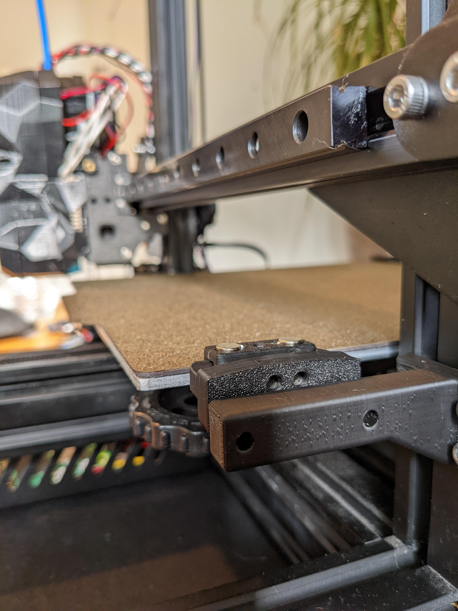
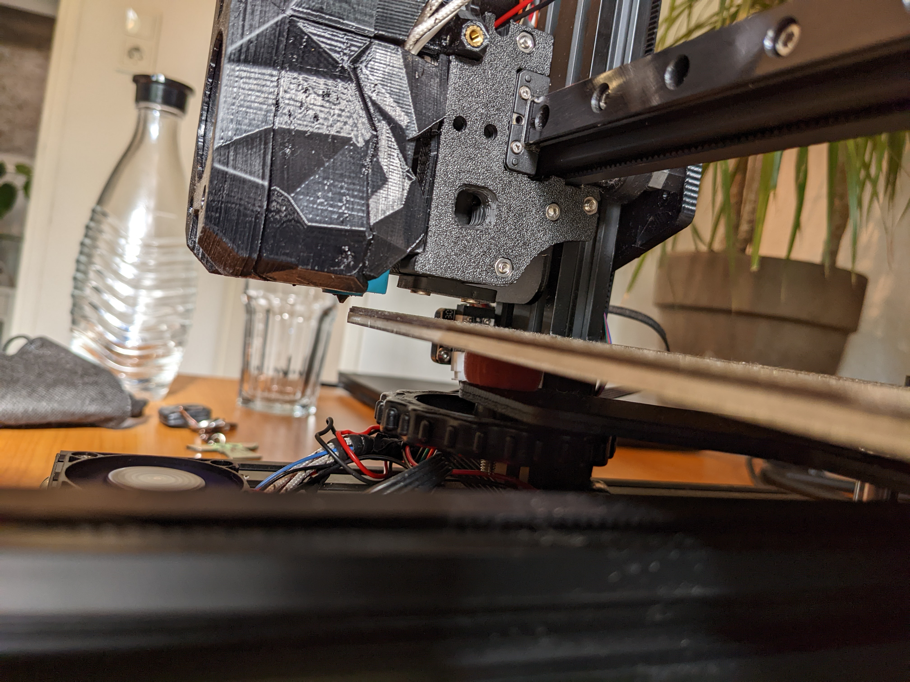

# Quickdraw-Ender3
Quickdraw Probe Dock for Ender 3 with Parts from Quickdraw (for Switchwire) by hymness1

Voron Stealthburner/Afterburner Toolhead needed. The Quickdraw probe works only with the original carriage with MGN12 and space behind the nozzle for a probe.

I used this carriage: https://www.printables.com/model/135563-vrn-10s-pro-mod-for-cr-10s-pro-with-voron-stealthb

Quickdraw Parts by hymness1: https://github.com/hymness1/VoronUsers/tree/master/printer_mods/hymness1/Quickdraw_probe_Voron_Switchwire
Use his parts and my dock which mounts via 4xM3 Screws and T-Nuts. There is some space for allignment but probably will clean up the design in the futre.






Because of the linear rail and carriage i lost a good amount of y-travel. I regained all the travel by moving the y-extrusion forward by replacing the original m5 screws with shorter ones and t-nuts in the rail.

I used kevinakasam configuration and macros of his klackender https://github.com/kevinakasam/KlackEnder-Probe but changed some x and z values for the mounting process.

```
[probe]
pin: gpio22 #Probe-Stop Connection on Skr Mini E3 DIP. Change this if needed!
z_offset: 4.690 #Measure per your specific setup
x_offset: 0 # negative = left of the nozzle
y_offset: 34 # negative = in front of of the nozzle
speed: 5.0
lift_speed: 15.0
sample_retract_dist: 1
samples: 2
samples_tolerance_retries: 6

##[(7x7)-1] / 2 = 24
##[(5x5)-1] / 2 = 12
[bed_mesh]
speed: 300
horizontal_move_z: 8
mesh_min: 8,30
mesh_max: 223,201
probe_count: 5,5
relative_reference_index: 12
algorithm: bicubic
fade_start: 1
fade_end: 10
#fade_target:
#   The z position in which fade should converge. When this value is set
#   to a non-zero value it must be within the range of z-values in the mesh.
#   Users that wish to converge to the z homing position should set this to 0.
#   Default is the average z value of the mesh.
split_delta_z: 0.015
#   The amount of Z difference (in mm) along a move that will
#   trigger a split. Default is .025.
move_check_distance: 3
#   The distance (in mm) along a move to check for split_delta_z.
#   This is also the minimum length that a move can be split. Default
#   is 5.0.
mesh_pps: 4,4
#   A comma separated pair of integers (X,Y) defining the number of
#   points per segment to interpolate in the mesh along each axis. A
#   "segment" can be defined as the space between each probed
#   point. The user may enter a single value which will be applied
#   to both axes.  Default is 2,2.
#bicubic_tension: .2
#   When using the bicubic algorithm the tension parameter above
#   may be applied to change the amount of slope interpolated.
#   Larger numbers will increase the amount of slope, which
#   results in more curvature in the mesh. Default is .2.

#####################################################################
#	KlackEnder- Macros
#####################################################################

[gcode_macro PROBE_OUT]
gcode:
    G90
    G1 Z15
    G1 X245 F20000
    G1 Z0
    G4 P300
    G1 Z20
    G1 X0

[gcode_macro PROBE_IN]
gcode:
    G90
    G1 Z20
    G1 X245 F20000
    G1 Z0
    G4 P300
    G1 X230 F1000
    G1 Z5
    G4 P300
    G1 X0 F20000
    G1 Z0

[gcode_macro AUTO_BED_MESH]
gcode:
    PROBE_OUT
    BED_MESH_CALIBRATE
    G1 Y0 F20000
    PROBE_IN
```